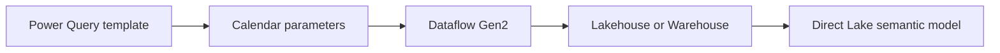

# Dataflow Gen2

Use Dataflow Gen2 when a visual Power Query workflow is the best fit. The repository includes a parameterized template that generates a reusable date table and can write it to a Lakehouse or Data Warehouse for Direct Lake consumption.

## Configure the template

Start from [`src/dynamic-date-table.pq`](https://github.com/Cloud2BR-MSFTLearningHub/Fabric-Date-Hierarchy-Accelerator/blob/main/src/dynamic-date-table.pq). Configure its date range, fiscal start month, and optional holiday data before publishing.

| Parameter | Typical example |
| --- | --- |
| Start date | `2020-01-01` |
| End date | `2030-12-31` |
| Fiscal year start month | `7` for July |
| Holiday list | Organization and regional non-working dates |

## Create the dataflow

1. Open the target Fabric workspace and create a **Dataflow Gen2** item.
2. Add a **Blank query** and open the Advanced Editor.
3. Paste the Power Query template from the repository.
4. Set the destination to the Lakehouse, Warehouse, or supported Power BI destination.
5. Name the output table consistently, such as `DateTable`.
6. Refresh and verify the generated fields and data range.

!!! important
    Confirm that a Lakehouse or Warehouse destination exists and that the user configuring the dataflow can write to it before publishing the query.

## Validate the output

After the refresh, check that the generated table has one row per date, continuous coverage for the intended reporting period, and sort columns that make month and quarter labels appear in the right order.

Use [Power BI template and operations](power-bi-template-and-operations.md) to turn the table into a shared hierarchy and measure convention.