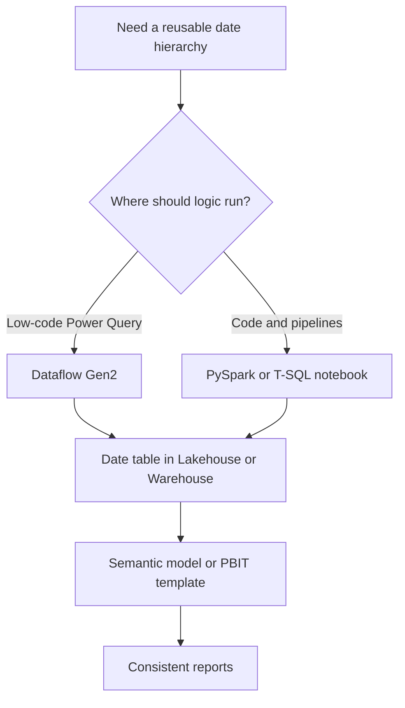

# Design and choose an approach

The accelerator has three compatible implementation paths. Each produces a governed date table that can feed a Power BI semantic model, Direct Lake workload, or Fabric warehouse.

## Choose the right path

| Approach | Best fit | Repository asset |
| --- | --- | --- |
| Dataflow Gen2 | Analysts who want a visual, parameterized Power Query workflow | [`src/dynamic-date-table.pq`](https://github.com/Cloud2BR-MSFTLearningHub/Fabric-Date-Hierarchy-Accelerator/blob/main/src/dynamic-date-table.pq) |
| Fabric notebook | Engineering teams needing code review, scheduling, or custom transformation logic | [`src/notebook-date-hierarchy-pyspark.ipynb`](https://github.com/Cloud2BR-MSFTLearningHub/Fabric-Date-Hierarchy-Accelerator/blob/main/src/notebook-date-hierarchy-pyspark.ipynb) and [`src/notebook-date-hierarchy-tsql.ipynb`](https://github.com/Cloud2BR-MSFTLearningHub/Fabric-Date-Hierarchy-Accelerator/blob/main/src/notebook-date-hierarchy-tsql.ipynb) |
| Power BI template | Report teams that need prebuilt hierarchy and measure conventions | [Power BI template workflow](power-bi-template-and-operations.md) |

## Date-table contract

Define these choices before creating a table. Keep them centrally documented and versioned so all reports follow the same conventions.

| Decision | Examples |
| --- | --- |
| Date range | A fixed reporting window, or a rolling range that extends ahead of the current date. |
| Calendar hierarchy | Year, quarter, month, week, and day. |
| Fiscal calendar | Fiscal start month, fiscal year label, and fiscal quarter logic. |
| ISO requirements | ISO week number and ISO year. |
| Holidays | Organization or regional dates used for business-day analysis. |
| Keys and labels | Stable date key, month sort key, display labels, and locale conventions. |

!!! tip
    Use one conformed table per reporting calendar whenever possible. Reusing the same fields and sort columns reduces report-specific DAX and eliminates hierarchy drift.

## Prerequisites

- A Microsoft Fabric workspace with access to the intended Lakehouse or Data Warehouse.
- Permission to create Dataflows, notebooks, pipelines, or semantic models for the selected path.
- Power BI Desktop for template authoring when using a `.pbit` distribution pattern.
- Git integration where teams need reviewable, versioned notebook or source assets.

Continue with [Dataflow Gen2](dataflow-gen2.md) for the low-code path or [Notebook automation](notebook-automation.md) for the code-first path.