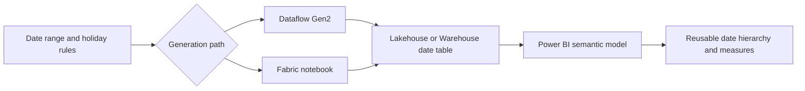

# Fabric Date Hierarchy Accelerator

Last updated: 2026-07-29

List of references

- [Direct Lake performance guidance](https://powerbi.microsoft.com/blog/leveraging-pure-direct-lake-mode-for-maximum-query-performance/)
- [Dataflow Gen2 destinations](https://learn.microsoft.com/fabric/data-factory/dataflow-gen2-data-destinations-and-managed-settings)
- [Fabric notebook source control](https://learn.microsoft.com/fabric/data-engineering/notebook-source-control-deployment)
- [Fabric Data Warehouse data types](https://learn.microsoft.com/fabric/data-warehouse/data-types)

Power BI does not create its usual automatic date hierarchy for DirectQuery and Direct Lake models. This accelerator standardizes reusable date tables, hierarchy fields, fiscal logic, and time-intelligence patterns so teams can build reports consistently across Microsoft Fabric.

!!! warning
    These guides are learning material. Confirm current Microsoft Fabric, Power BI, support, pricing, and compliance requirements in Microsoft's official documentation before production use.

  <a class="guide-card" href="design-and-choice/"><strong>Design and choose an approach</strong> Compare the three paths and define the date-table contract before implementation.</a>
  <a class="guide-card" href="dataflow-gen2/"><strong>Dataflow Gen2</strong> Use the parameterized Power Query template to publish a reusable Lakehouse table.</a>
  <a class="guide-card" href="notebook-automation/"><strong>Notebook automation</strong> Generate and schedule a table with PySpark or T-SQL in Fabric.</a>
  <a class="guide-card" href="power-bi-template-and-operations/"><strong>Power BI template and operations</strong> Standardize hierarchies and measures, then operate them as versioned assets.</a>

## Start here

| Need | Start with |
| --- | --- |
| Decide which implementation path fits the team | [Design and choose an approach](design-and-choice.md) |
| Configure a low-code reusable date table | [Dataflow Gen2](dataflow-gen2.md) |
| Build code-first and pipeline-friendly automation | [Notebook automation](notebook-automation.md) |
| Distribute a standard model to report authors | [Power BI template and operations](power-bi-template-and-operations.md) |