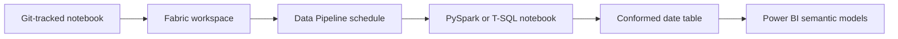

# Notebook automation

Fabric notebooks are the code-first option for generating and maintaining date tables. They support reviewable logic, pipeline scheduling, and custom rules that may be awkward to express in a visual dataflow.

## PySpark path

Use [`src/notebook-date-hierarchy-pyspark.ipynb`](https://github.com/Cloud2BR-MSFTLearningHub/Fabric-Date-Hierarchy-Accelerator/blob/main/src/notebook-date-hierarchy-pyspark.ipynb) when you want to generate the table through Spark.

1. Create or upload a PySpark notebook in the Fabric workspace.
2. Attach the intended Lakehouse through the Fabric UI.
3. Run the notebook cells to create and save the date table.
4. Schedule it through a Data Pipeline when the date range, holidays, or derived fields need recurring maintenance.

!!! important
    A Lakehouse cannot be attached to a Fabric notebook through code alone. Attach it through **Add data item** in the Fabric notebook interface before running the notebook.

## T-SQL path

Use [`src/notebook-date-hierarchy-tsql.ipynb`](https://github.com/Cloud2BR-MSFTLearningHub/Fabric-Date-Hierarchy-Accelerator/blob/main/src/notebook-date-hierarchy-tsql.ipynb) for a T-SQL-oriented workflow.

1. Use a Fabric Data Warehouse when the logic requires `CREATE TABLE` or CTAS statements.
2. Create or upload a notebook with a T-SQL kernel, or run the script through a pipeline activity.
3. Run the notebook and validate the resulting `dbo.DateTable` or configured table name.
4. Consume the table from the Power BI semantic model.

!!! tip
    Avoid temporary tables and table variables in Fabric Data Warehouse workflows. Use permanent staging tables or common table expressions instead.

## Operate through a pipeline

Schedule a refresh cadence that aligns with calendar maintenance. A daily or weekly schedule is typical when tables use a rolling end date; holiday changes may need a separate controlled update.