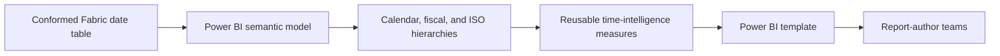

# Power BI template and operations

Use a Power BI template (`.pbit`) to distribute a standard date hierarchy, sort logic, and common measures without distributing business data. The template is the presentation and semantic-model layer on top of the shared Fabric date table.

## Build the semantic model

1. Create the reusable date table through [Dataflow Gen2](dataflow-gen2.md) or [Notebook automation](notebook-automation.md).
2. Connect Power BI to the Lakehouse or Warehouse using the chosen storage and connectivity mode.
3. Add hierarchy fields such as **Year > Quarter > Month > Day** and fiscal or ISO variants where needed.
4. Create standardized measures for YTD, MTD, QTD, prior-year comparisons, and holiday-aware analysis.
5. Configure each text label to sort by the corresponding numeric key.

## Export and distribute the template

Export the finished model through **File > Export > Power BI template**. A template preserves the model structure, hierarchies, and measures while keeping data out of the artifact.

## Operational checklist

- Store notebook, Dataflow source, and `.pbit` assets in version control.
- Document the calendar contract and change process.
- Review fiscal and holiday rule changes before publishing.
- Keep report models on a shared date-table version where possible.
- Use Fabric Git integration, pull requests, and deployment pipelines for promotion across workspaces.
- Schedule the producing Dataflow or notebook and monitor failures.

!!! warning
    Date-table changes can affect report filters, relationships, and time-intelligence results. Test changes in a non-production workspace before promoting them to shared semantic models.